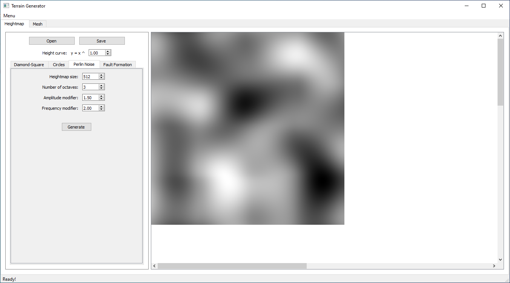
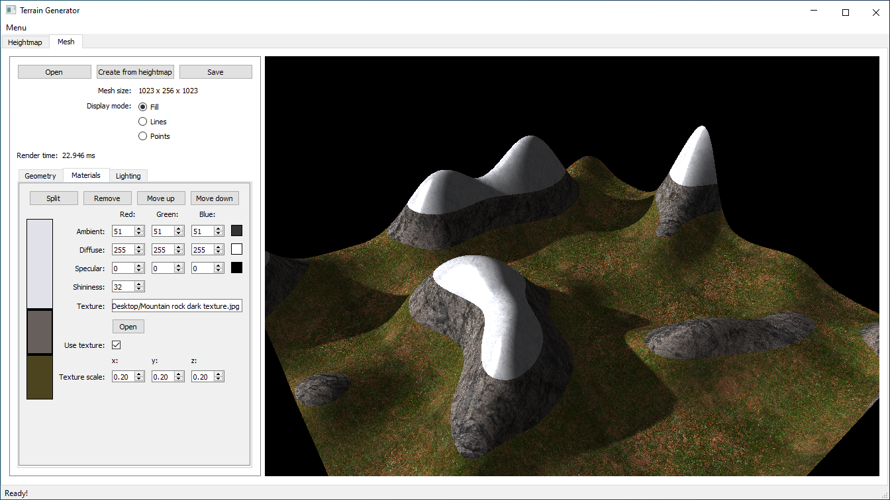
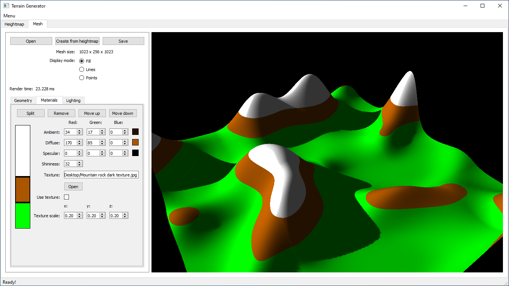
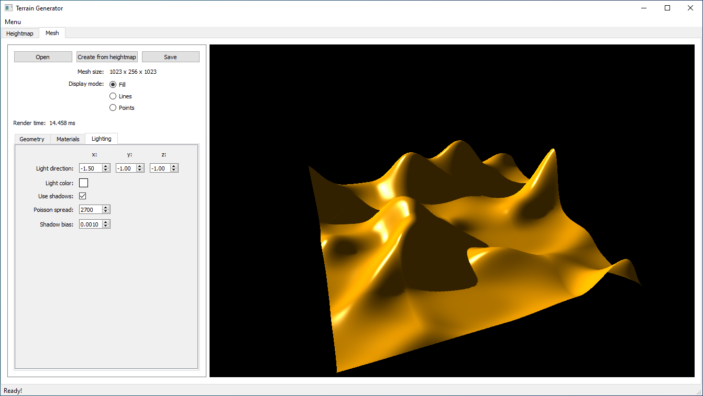

# Terrain Generator

Application for generation and visualization of terrains with textures and shadow mapping.

### External libraries:

- Qt5
- glm
- GLEW
- Assimp

### Features:

- can generate heightmaps with one of 4 different algorithms: 
  - Diamond-Square
  - Perlin Noise
  - Fault Formation
  - Circles 
- loading/saving of heightmaps from/to image files 
- can generate a 3D mesh from a heightmap 
- the 3D mesh can be scaled along the y-axis
- loading/saving of 3D meshes from/to model files (only geometry information is loaded/saved)
- can display 3D meshes with OpenGL using the Phong lighting model 
- can display shadows using the Shadow Mapping algorithm
- light direction and color can be changed 
- material properties of the 3D mesh can be set (ambient, diffuse and specular colors, shininess and optionally textures) 
- textures can be applied to the 3D mesh and scaled as needed
- different colors/textures can be set for different elevation ranges using a custom widget designed for this purpose

### Images:

